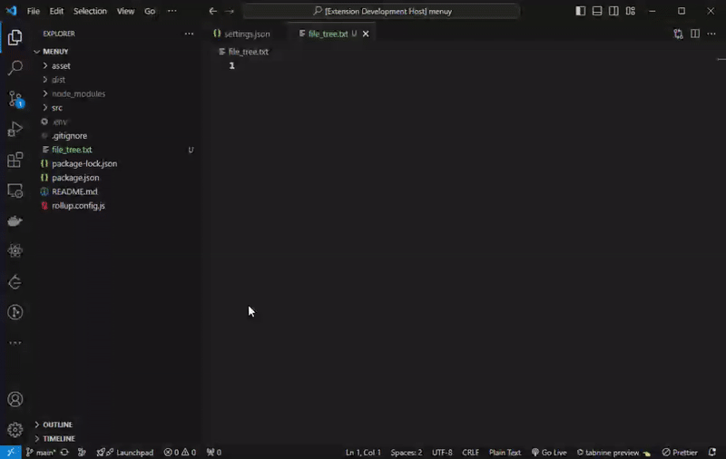

<p align="center">
  
</p>

---

<h1 align="center">
File Tree Extractor
</h1>

<p align="center">
Generate a directory structure with a simple copy and paste.
</p>

</br>
<p align="center">
  
</p>

## Features

- 1️⃣ **Extract from Any Directory**: Support extracting file tree from the root or any subdirectory.
- 2️⃣ **File Filtering**: Automatically filter files based on your project's `.gitignore` or custom ignore rules.
- 3️⃣ **Highly Customizable**: Numerous configuration options to tailor the output.
- 4️⃣ **Multiple Output Formats**: Generate tree structure in ASCII or JSON format.
- 5️⃣ **File Size Information**: Optionally include file sizes in the output.
- 6️⃣ **Depth Control**: Set a maximum depth for the generated tree structure.

## Usage

1. Right-click on a folder in the VS Code file explorer
2. Select "Copy File Tree" or "Copy File Tree From This Directory"
3. The file tree will be copied to your clipboard
4. Paste the tree wherever you need it

> Alternatively, use the keyboard shortcut `Ctrl`+`Alt`+`C` to copy the file tree of the entire project.

```
root/
├── .env
├── .gitignore
├── asset/
│   ├── icon/
│   │   └── icon.png
│   ├── logo.svg
│   └── logo_text.svg
├── dist/
│   ├── index.d.ts
│   ├── main.esm.js
│   ├── main.js
│   ├── main.min.js
│   ├── main.min.js.map
│   └── main.umd.js
├── file_tree.txt
├── package-lock.json
├── package.json
├── README.md
├── rollup.config.js
└── src/
    ├── config.js
    ├── error.js
    ├── index.js
    ├── render.js
    ├── util.js
    └── validate.js
```


## Configuration

You can customize the extension's behavior through VS Code settings.

To access these settings, go to `File` > `Preferences` > `Settings` and search for `"File Tree Extractor"`.

</br>

### `fileTreeExtractor.ignoredItems`

**Description:**
This setting allows you to specify a list of files and folders that should be ignored when generating the file tree. It is useful if you want to exclude certain files or folders from the generated file tree, such as temporary or cached files, or other directories that are not part of your project's main structure.

**Default Value:**
`[".git", "node_modules"]`

**`settings.json`**
```json
"fileTreeExtractor.ignoredItems": [".git", "node_modules", "dist", "**/src"]
```

```
root/
├── .env
├── .gitignore
├── asset/
│   ├── icon/
│   │   └── icon.png
│   ├── logo.svg
│   └── logo_text.svg
├── package-lock.json
├── package.json
├── README.md
└── rollup.config.js
```

</br>

### `fileTreeExtractor.ignoredBy`

**Description:**
Specifies the method to ignore files and folders when generating the file tree structure.

**Options:**
`"gitignore"` | `"ignoredItems"` | `"both"`  
**Default Value:**
`"ignoredItems"`

**`settings.json`**
```json
"fileTreeExtractor.ignoredBy": "ignoredItems"
```

- `"gitignore"`: The extension will use the `.gitignore` file to determine which files and folders to ignore.
- `"ignoredItems"`: The extension will use `"fileTreeExtractor.ignoredItems"` specified in the extension settings.
- `"both"`: The extension will use both `"ignoredItems"` and `"gitignore"` method.

</br>

### `fileTreeExtractor.indent`

**Description:**
The number of spaces to use for indenting each level in the generated file tree.

**Default Value:**
`1`

**`settings.json`**
```json
"fileTreeExtractor.indent": 4
```

```
root/
├──── .env
├──── .gitignore
├──── asset/
│     ├──── icon/
│     │     └──── icon.png
│     ├──── logo.svg
│     └──── logo_text.svg
├──── package-lock.json
├──── package.json
├──── README.md
└──── rollup.config.js
```

</br>

### `fileTreeExtractor.showFileSize`

**Description:**
Include file sizes in the generated tree.

**Options:**
`"true"` | `"false"`  
**Default Value:**
`"false"`

**`settings.json`**
```json
"fileTreeExtractor.showFileSize": true
```

```
root/
├── .env (0 Bytes)
├── .gitignore (135 Bytes)
├── asset/
│   ├── icon/
│   │   └── icon.png (1.36 MB)
│   ├── logo.svg (677 Bytes)
│   └── logo_text.svg (1.71 KB)
├── package-lock.json (217.22 KB)
├── package.json (1.27 KB)
├── README.md (0 Bytes)
└── rollup.config.js (1.27 KB)
```

</br>

### `fileTreeExtractor.maxDepth`

**Description:**
Sets the maximum depth of the generated file tree structure. Using a value of `-1` will generate the tree with unlimited depth.


**Default Value:**
`-1`

**`settings.json`**
```json
"fileTreeExtractor.maxDepth": 3
```

```
root/
├── .env
├── .gitignore
├── asset/
│   ├── icon/
│   ├── logo.svg
│   └── logo_text.svg
├── package-lock.json
├── package.json
├── README.md
└── rollup.config.js
```

</br>

### `fileTreeExtractor.outputFormat`

**Description:**
The format of the output tree structure.

**Options:**
`"ascii"` | `"json"` | `"yaml"` | `"xml"`  
**Default Value:**
`"ascii"`

**`settings.json`**
```json
"fileTreeExtractor.outputFormat": "json"
```

```
{
  "name": "root",
  "type": "directory",
  "children": [
    {
      "name": "asset",
      "type": "directory",
      "children": [
        {
          "name": "icon",
          "type": "directory",
          "children": [
            {
              "name": "icon.png",
              "type": "file",
              "size": "104.36 KB"
            }
          ]
        },
        {
          "name": "logo.svg",
          "type": "file",
          "size": "677 Bytes"
        },
      ]
    },
    {
      "name": "package.json",
      "type": "file",
      "size": "1.27 KB"
    },
  ]
}
```

</br>

### `fileTreeExtractor.directoryOnly`

**Description:**
Show only directories in the tree structure, excluding all files from the output.

**Default Value:**
`false`

**`settings.json`**
```json
"fileTreeExtractor.directoryOnly": true
```

```
menuy/
├── asset/
│   └── icon/
├── dist/
└── src/
```

</br>

## Commands

- `File Tree Extractor: Copy File Tree`
- `File Tree Extractor: Copy File Tree From This Directory`
- `File Tree Extractor: Report an Issue`


## Feedback & Contributions

We welcome your feedback and contributions! Please report any issues or suggestions through:
- The "Report an Issue" command in VS Code
- Our [GitHub repository](https://github.com/fuzionix/vscode-file-tree/issues)

## License

This extension is licensed under the [MIT License](LICENSE).
